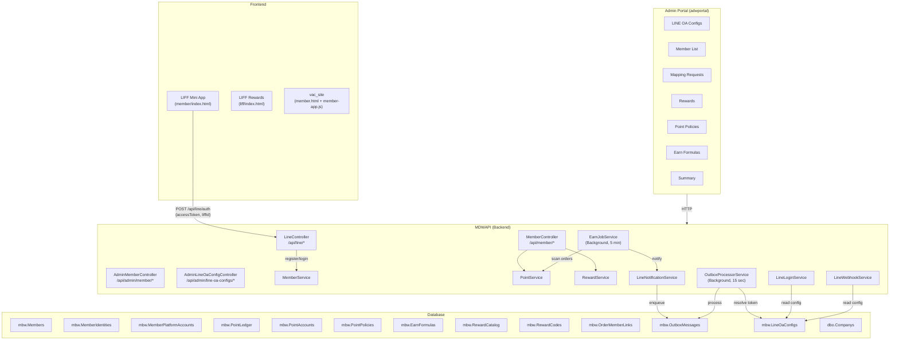
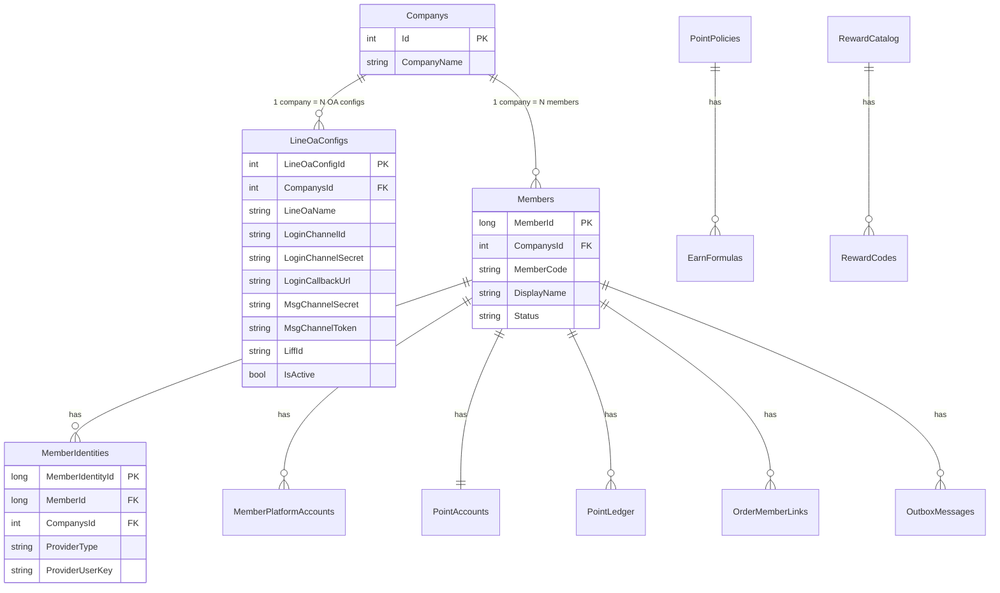

# 📋 สรุประบบ Member Loyalty — ทั้งหมดที่ทำ

> สรุป ณ 2026-03-18

---

## 🏗️ Architecture Overview



---

## 📁 ไฟล์ที่สร้าง/แก้ทั้งหมด

### Backend — MDWAPI

#### Entities (Models)
| ไฟล์ | สถานะ | รายละเอียด |
|------|-------|-----------|
| [Member.cs](file:///d:/@Project/miniApp2GitVAC/AnalystData/MDWAPI/src/MDWAPI/Entities/Member.cs) | แก้ไข | เพิ่ม [CompanysId](file:///d:/@Project/miniApp2GitVAC/AnalystData/MDWAPI/src/MDWAPI/Services/MemberService.cs#66-94) FK ที่ [Member](file:///d:/@Project/miniApp2GitVAC/AnalystData/MDWAPI/src/MDWAPI/Entities/Member.cs#7-30) และ [MemberIdentity](file:///d:/@Project/miniApp2GitVAC/AnalystData/MDWAPI/src/MDWAPI/Entities/Member.cs#32-50) |
| [LineOaConfig.cs](file:///d:/@Project/miniApp2GitVAC/AnalystData/MDWAPI/src/MDWAPI/Entities/LineOaConfig.cs) | ✨ ใหม่ | Entity สำหรับ `mbw.LineOaConfigs` — เก็บ credential LINE OA per company |

#### Services
| ไฟล์ | สถานะ | รายละเอียด |
|------|-------|-----------|
| [MemberService.cs](file:///d:/@Project/miniApp2GitVAC/AnalystData/MDWAPI/src/MDWAPI/Services/MemberService.cs) | แก้ไข | [RegisterAsync](file:///d:/@Project/miniApp2GitVAC/AnalystData/MDWAPI/src/MDWAPI/Services/MemberService.cs#14-65) set [CompanysId](file:///d:/@Project/miniApp2GitVAC/AnalystData/MDWAPI/src/MDWAPI/Services/MemberService.cs#66-94), เพิ่ม [EnsureCompanysIdAsync](file:///d:/@Project/miniApp2GitVAC/AnalystData/MDWAPI/src/MDWAPI/Services/MemberService.cs#66-94) backfill |
| [PointService.cs](file:///d:/@Project/miniApp2GitVAC/AnalystData/MDWAPI/src/MDWAPI/Services/PointService.cs) | เดิม | Earn/Burn/Reserve/Release/Adjust + PointPolicyEngine |
| [RewardService.cs](file:///d:/@Project/miniApp2GitVAC/AnalystData/MDWAPI/src/MDWAPI/Services/RewardService.cs) | เดิม | Catalog CRUD, Code management, Redeem |
| [LineNotificationService.cs](file:///d:/@Project/miniApp2GitVAC/AnalystData/MDWAPI/src/MDWAPI/Services/LineNotificationService.cs) | แก้ไข | Resolve [CompanysId](file:///d:/@Project/miniApp2GitVAC/AnalystData/MDWAPI/src/MDWAPI/Services/MemberService.cs#66-94) จาก identity → member → ใส่ใน outbox payload |
| [LineService.cs](file:///d:/@Project/miniApp2GitVAC/AnalystData/MDWAPI/src/MDWAPI/Services/LineService.cs) | แก้ไข | เปลี่ยนจากอ่าน appsettings → อ่านจาก `mbw.LineOaConfigs` DB |
| [EarnJobService.cs](file:///d:/@Project/miniApp2GitVAC/AnalystData/MDWAPI/src/MDWAPI/Services/EarnJobService.cs) | เดิม | Background job ทุก 5 นาที: link orders → earn points → notify |
| [OutboxProcessorService.cs](file:///d:/@Project/miniApp2GitVAC/AnalystData/MDWAPI/src/MDWAPI/Services/OutboxProcessorService.cs) | แก้ไข | Resolve LINE token per company จาก [LineOaConfigs](file:///d:/@Project/miniApp2GitVAC/AnalystData/adwportal/adwportal/Services/MemberAdminService.cs#256-262) |

#### Controllers
| ไฟล์ | สถานะ | รายละเอียด |
|------|-------|-----------|
| [LineController.cs](file:///d:/@Project/miniApp2GitVAC/AnalystData/MDWAPI/src/MDWAPI/Controllers/LineController.cs) | แก้ไข | เพิ่ม `GET /api/line/config` (multi-company), auto-set CompanysId ตอน auth |
| [MemberController.cs](file:///d:/@Project/miniApp2GitVAC/AnalystData/MDWAPI/src/MDWAPI/Controllers/MemberController.cs) | เดิม | Member-facing APIs |
| [AdminMemberController.cs](file:///d:/@Project/miniApp2GitVAC/AnalystData/MDWAPI/src/MDWAPI/Controllers/AdminMemberController.cs) | เดิม | Admin-facing member management APIs |
| [AdminLineOaConfigController.cs](file:///d:/@Project/miniApp2GitVAC/AnalystData/MDWAPI/src/MDWAPI/Controllers/AdminLineOaConfigController.cs) | ✨ ใหม่ | CRUD API for LINE OA Configs |

#### Database
| ไฟล์ | สถานะ | รายละเอียด |
|------|-------|-----------|
| [create_lineoa_configs.sql](file:///d:/@Project/miniApp2GitVAC/AnalystData/MDWAPI/db/create_lineoa_configs.sql) | ✨ ใหม่ | สร้าง table `mbw.LineOaConfigs` + FK [CompanysId](file:///d:/@Project/miniApp2GitVAC/AnalystData/MDWAPI/src/MDWAPI/Services/MemberService.cs#66-94) ที่ Members/Identities |
| [AppDbContext.cs](file:///d:/@Project/miniApp2GitVAC/AnalystData/MDWAPI/src/MDWAPI/Data/AppDbContext.cs) | แก้ไข | เพิ่ม DbSet [LineOaConfigs](file:///d:/@Project/miniApp2GitVAC/AnalystData/adwportal/adwportal/Services/MemberAdminService.cs#256-262) + model config |

#### Config
| ไฟล์ | สถานะ | รายละเอียด |
|------|-------|-----------|
| [appsettings.json](file:///d:/@Project/miniApp2GitVAC/AnalystData/MDWAPI/src/MDWAPI/appsettings.json) | แก้ไข | Comment out `Line:Login` / `Line:Messaging` (ย้ายไป DB) |

### Frontend — MDWAPI wwwroot
| ไฟล์ | สถานะ | รายละเอียด |
|------|-------|-----------|
| [member/index.html](file:///d:/@Project/miniApp2GitVAC/AnalystData/MDWAPI/src/MDWAPI/wwwroot/member/index.html) | แก้ไข | Dynamic LIFF ID + ส่ง liffId ใน auth request |
| [liff/index.html](file:///d:/@Project/miniApp2GitVAC/AnalystData/MDWAPI/src/MDWAPI/wwwroot/liff/index.html) | แก้ไข | Dynamic LIFF ID + ส่ง liffId ใน auth request |

### Frontend — vac_site
| ไฟล์ | สถานะ | รายละเอียด |
|------|-------|-----------|
| [member.html](file:///d:/@Project/miniApp2GitVAC/vibeandchicweb/vibeandchicweb/vac_site/wwwroot/member.html) | แก้ไข | Dynamic LIFF ID + ส่ง liffId ใน auth request |
| [js/member-app.js](file:///d:/@Project/miniApp2GitVAC/vibeandchicweb/vibeandchicweb/vac_site/wwwroot/js/member-app.js) | แก้ไข | Dynamic LIFF ID + ส่ง liffId ใน auth request |

### Admin Portal — adwportal
| ไฟล์ | สถานะ | รายละเอียด |
|------|-------|-----------|
| [LineOaConfigs.razor](file:///d:/@Project/miniApp2GitVAC/AnalystData/adwportal/adwportal/Components/Pages/Member/LineOaConfigs.razor) | ✨ ใหม่ | หน้า CRUD จัดการ LINE OA Config |
| [MainLayout.razor](file:///d:/@Project/miniApp2GitVAC/AnalystData/adwportal/adwportal/Components/Layout/MainLayout.razor) | แก้ไข | เพิ่มเมนู "LINE OA" เป็นเมนูแรกใน Member group |
| [MemberAdminService.cs](file:///d:/@Project/miniApp2GitVAC/AnalystData/adwportal/adwportal/Services/MemberAdminService.cs) | แก้ไข | เพิ่ม service methods + ViewModel สำหรับ LINE OA Config CRUD |

---

## 🔧 Features ทั้งหมด

### 1. 👤 สมัครสมาชิก & เข้าสู่ระบบ
- **LINE LIFF Login** — ผู้ใช้เปิด Mini App → ล็อกอิน LINE อัตโนมัติ
- **LINE OAuth Callback** — redirect flow สำหรับ browser ปกติ
- **Auto-register** — ถ้ายังไม่เป็นสมาชิก → สร้าง Member + Identity อัตโนมัติ
- **Auto-set CompanysId** — match LIFF ID → LineOaConfig → CompanysId ตอน register
- **Backfill CompanysId** — member เก่าที่ยังไม่มี CompanysId จะถูก set ตอน login ครั้งถัดไป
- **PKCE error handling** — clear LIFF cache + re-login อัตโนมัติ
- **Dev mode** — `?code=MBW-000002` bypass LIFF บน localhost

### 2. 💰 ระบบแต้ม (Points)
- **Point Policies** — กำหนดอัตราสะสมตามแพลตฟอร์ม + ช่วงเวลา
- **Earn Formulas** — สูตรคำนวณแต้มจาก DB (Amount / X * Rate)
- **Earn Job** (Background, ทุก 5 นาที):
  - Phase 1: Scan orders → match กับ verified platform accounts → link + earn
  - Phase 1.5: Retroactive earn (linked แล้วแต่ยังไม่ earn)
  - Phase 2: Auto-reverse (return/refund → หักแต้มคืน)
- **Idempotency** — `EARN-ORDER-{id}` key ป้องกันสะสมซ้ำ
- **Admin adjust** — ปรับแต้มด้วยมือ
- **Point Balance** — Available, Total Earned, Total Burned, Reserved

### 3. 🎁 รางวัล (Rewards)
- **Reward Catalog CRUD** — สร้าง/แก้ไข/เปิด-ปิดรางวัล
- **Reward Codes** — เพิ่มโค้ดเป็น batch ต่อรางวัล
- **Member Redeem** — แลกแต้มเป็นรางวัล → หักแต้ม + จ่ายโค้ด
- **My Codes** — ดูประวัติโค้ดที่แลกไป + คัดลอก

### 4. 🔔 LINE Notifications
- **Outbox Pattern** — เขียน message ลง `OutboxMessages` → background processor ส่ง
- **ประเภทข้อความ:**
  - 🎉 ได้รับแต้ม (earn)
  - 📋 ปรับแต้ม (reversal/return)
  - 🎁 แลกรางวัลสำเร็จ (redemption + code)
- **Multi-company routing** — CompanysId → LineOaConfigs → MsgChannelToken
- **Retry + fail handling** — MaxRetry=3, status tracking

### 5. 🏢 Multi-Company LINE OA
- **`mbw.LineOaConfigs` table** — เก็บ credential LINE OA ต่อ company
  - Login: ChannelId, ChannelSecret, CallbackUrl
  - Messaging: ChannelSecret, ChannelAccessToken
  - LIFF: LiffId
- **Admin CRUD** — `/api/admin/line-oa-configs` + หน้าจัด adwportal
- **Secret masking** — ซ่อน secret/token ในหน้า list
- **Dynamic LIFF ID** — Frontend fetch จาก `GET /api/line/config` แทน hardcode
- **LineLoginService + LineWebhookService** — อ่าน credential จาก DB แทน appsettings
- **OutboxProcessorService** — resolve token per company จาก payload

### 6. 🔗 Platform Linking
- **Request flow** — member ส่งคำขอผูก Shopee/Lazada/TikTok account
- **Admin approve/reject** — admin review + approve → Verified status
- **Auto-earn** — verified accounts จะถูก match กับ orders อัตโนมัติ
- **Mapping Requests** — admin ดูคำขอ pending ทั้งหมด

### 7. 📊 Admin Portal
| หน้า | คำอธิบาย |
|------|---------|
| **LINE OA** | CRUD + toggle active LINE OA Config |
| **Member List** | ค้นหา + ดู member ทั้งหมด |
| **Member Detail** | Profile, points, platforms, history |
| **Mapping Requests** | Approve/reject platform linking |
| **Rewards** | สร้าง/แก้ไขรางวัล + เพิ่มโค้ด |
| **Point Policies** | CRUD + toggle active |
| **Earn Formulas** | CRUD สูตรคำนวณแต้ม |
| **Summary** | Dashboard สถิติ |

---

## 🔌 API Endpoints

### Public (ไม่ต้อง auth)
| Method | Endpoint | คำอธิบาย |
|--------|---------|----------|
| GET | `/api/line/config?companyId=&liffId=&domain=` | ดึง LIFF config (multi-company) |
| GET | `/api/line/login` | Redirect ไป LINE Login |
| GET | `/api/line/callback` | LINE callback + auto register |
| POST | `/api/line/auth` | LIFF auth { accessToken, liffId } |
| POST | `/api/line/webhook` | LINE Messaging webhook |

### Member-facing
| Method | Endpoint | คำอธิบาย |
|--------|---------|----------|
| POST | `/api/member/register` | สมัครสมาชิก |
| GET | `/api/member/{id}` | ดู profile |
| PUT | `/api/member/{id}/profile` | แก้ไข profile |
| GET | `/api/member/{id}/points/history` | ดูประวัติแต้ม |
| GET | `/api/member/rewards` | ดูรางวัลที่แลกได้ |
| POST | `/api/member/rewards/redeem` | แลกรางวัล |
| GET | `/api/member/{id}/redemptions` | ดูโค้ดที่แลก |
| POST | `/api/member/{id}/platform-link` | ส่งคำขอผูก platform |
| GET | `/api/member/{id}/platform-requests` | ดูคำขอของตัวเอง |

### Admin
| Method | Endpoint | คำอธิบาย |
|--------|---------|----------|
| GET/POST/PUT/DELETE | `/api/admin/line-oa-configs/*` | CRUD LINE OA Configs |
| GET | `/api/admin/member/search` | ค้นหา member |
| POST | `/api/admin/member/{id}/adjust-points` | ปรับแต้ม |
| GET/PUT | `/api/admin/member/mapping-requests/*` | จัดการ mapping requests |
| GET/POST/PUT/DELETE | `/api/admin/member/rewards/*` | CRUD rewards |

---

## 🗄️ Database Tables



---

## 🔄 Key Flows

### Flow 1: สมัครสมาชิกผ่าน LIFF
```
1. เปิด Mini App → fetch /api/line/config → ได้ liffId
2. liff.init({ liffId }) → LINE Login
3. POST /api/line/auth { accessToken, liffId }
4. Backend: match liffId → LineOaConfigs → CompanysId
5. ไม่เจอ member → RegisterAsync({ ..., CompanysId })
6. สร้าง Member + MemberIdentity + PointAccount (ทั้งหมดมี CompanysId)
7. Return profile → Frontend แสดงหน้า member
```

### Flow 2: สะสมแต้มอัตโนมัติ
```
1. EarnJobService รันทุก 5 นาที
2. Scan verified MemberPlatformAccounts
3. Match กับ UnifiedOrders (Channel + BuyerUsername + COMPLETED)
4. CalculateEarnAsync → PointPolicyEngine → EarnFormulas
5. EarnAsync → PointLedger + PointAccount update
6. NotifyEarnAsync → OutboxMessages
7. OutboxProcessorService (ทุก 15 วิ) → resolve token from LineOaConfigs → push LINE message
```

### Flow 3: แลกรางวัล
```
1. Member เลือกรางวัล → POST /api/member/rewards/redeem
2. ตรวจ: มีแต้มพอ? มี stock? มี code?
3. Reserve points → Burn points → Assign code
4. NotifyRedemptionAsync → OutboxMessages → LINE push "🎁 แลกสำเร็จ!"
5. Frontend แสดง code + copy button
```

---

## ⚠️ สิ่งที่ยังเหลือพิจารณา (ไม่ Block)

1. **[member-app.js](file:///d:/@Project/miniApp2GitVAC/vibeandchicweb/vibeandchicweb/vac_site/wwwroot/js/member-app.js) MB_API_BASE** ชี้ `localhost:7192` — deploy production ต้องเปลี่ยน URL
2. **appsettings.json** ยังมี Line config แบบ comment — ลบออกได้เลย
3. **Point Expiry** — ยังไม่มี logic หมดอายุแต้ม (ถ้าต้องการ)
4. **Multi-LIFF per Company** — ถ้า 1 company ต้องการหลาย LIFF (member vs rewards)
